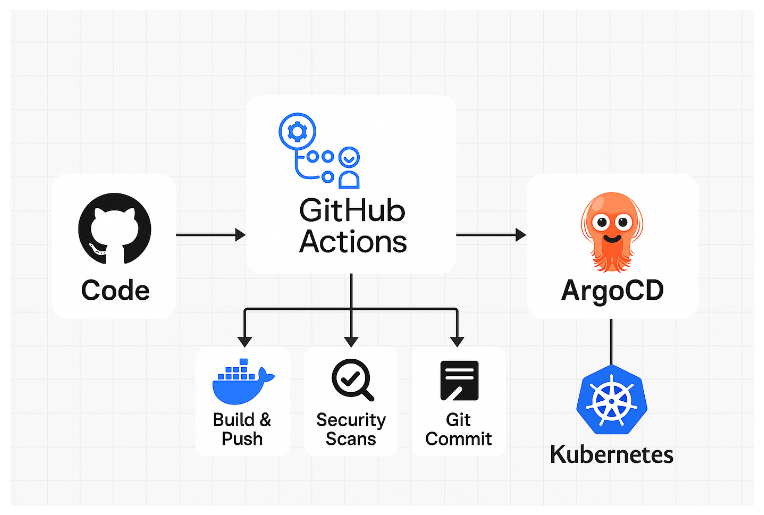

# GitOps CI/CD Pipeline with GitHub Actions and ArgoCD



This project demonstrates a **GitOps-based CI/CD pipeline** using **GitHub Actions** and **ArgoCD** to deploy applications on Kubernetes.

The application is a simple **Python Flask API**. The main objective is not the application itself, but to **learn and practice GitOps workflows in a realistic environment**.

Even though the application is minimal, the architecture is designed to be easily extended to more complex and production-ready systems.


---

# Project Structure

```bash
.
├── app.py              # Flask application
├── Dockerfile          # Container image definition
├── .github/workflows/cicd.yml # pipeline gitops cicd with argocd
├── manifests-k8s       # manifest yaml k8s 
│   ├── deployment.yml
│   └── service.yml
├── requirements.txt    # Python dependencies
└── README.md
```

---

# Setup Overview

## Infrastructure

* Kubernetes cluster: Minikube
* Container runtime: Docker
* CI/CD pipeline: GitHub Actions
* GitOps tool: ArgoCD
* Cloud provider: VirtualData (CNRS)
* Provisioning: Terraform with cloud-init

The entire environment is deployed on a virtual machine provisioned via Terraform, with automatic setup using cloud-init scripts.

---

# VM Bootstrap (cloud-init)

The following tools are installed automatically with terraform (cloud-init) on an AlmaLinux 9.x VM:

```bash
# Docker installation
yum-config-manager --add-repo https://download.docker.com/linux/centos/docker-ce.repo
yum install -y docker-ce docker-ce-cli containerd.io
systemctl enable docker
systemctl start docker

# kubectl installation
curl -LO https://dl.k8s.io/release/v1.30.0/bin/linux/amd64/kubectl
install -o root -g root -m 0755 kubectl /usr/local/bin/kubectl
rm -f kubectl

# Minikube installation
curl -LO https://github.com/kubernetes/minikube/releases/latest/download/minikube-linux-amd64
install minikube-linux-amd64 /usr/local/bin/minikube
rm -f minikube-linux-amd64

# Create non-root user for Minikube
useradd -m devops || true
usermod -aG docker devops

# Start Minikube
su - devops -c "minikube start --driver=docker"
su - devops -c "minikube addons enable ingress"

# Configure kubectl access
mkdir -p /root/.kube
cp /home/devops/.kube/config /root/.kube/config || true
export KUBECONFIG=/root/.kube/config

# Install ArgoCD
su - devops -c "kubectl create namespace argocd || true"
su - devops -c "kubectl apply -n argocd -f https://raw.githubusercontent.com/argoproj/argo-cd/stable/manifests/install.yaml"

sleep 60

# Expose ArgoCD service via NodePort
kubectl patch svc argocd-server -n argocd -p '{"spec": {"type": "NodePort"}}'
```

---

# Accessing ArgoCD UI

After deployment, connect to the VM:

```bash
sudo su - devops
kubectl get svc -n argocd
```

## Option 1: Port Forward (recommended for testing)

```bash
# HTTP
kubectl port-forward --address 0.0.0.0 svc/argocd-server 8000:80 -n argocd

# HTTPS
kubectl port-forward --address 0.0.0.0 svc/argocd-server 8443:443 -n argocd
```

Access in browser:

```bash
http://<VM_PUBLIC_IP>:8000
```

Important:

* The command must remain running
* Ensure the firewall allows the port

Example:

```bash
sudo firewall-cmd --add-port=8000/tcp --permanent
sudo firewall-cmd --reload
```

---

## Optional: Access Flask Application

```bash
kubectl port-forward --address 0.0.0.0 svc/my-service 5000:5000 -n argocd
```

Access:

```
http://<VM_PUBLIC_IP>:5000
```

---

# Get ArgoCD Admin Password

```bash
kubectl get secret argocd-initial-admin-secret \
  -n argocd \
  -o jsonpath="{.data.password}" | base64 -d
```

Credentials:

* Username: admin
* Password: output of the command above

---

# Configure it in your VM in the same way
## GitHub Secrets Configuration

### Personal Access Token

Required for GitHub Actions to push changes.

Create it in:
Settings → Developer Settings → Personal Access Tokens

Required scopes:

* repo
* workflow
* admin:repo_hook

---

## Repository Secrets

Go to:
Repository → Settings → Secrets and variables → Actions

### ArgoCD

```
ARGOCD_SERVER
ARGOCD_USERNAME
ARGOCD_PASSWORD
```

### Docker Hub

```
DOCKERHUB_USERNAME
DOCKERHUB_TOKEN
```

### Git Identity (CI commits)

```
PERSONAL_ACCESS_TOKEN
GIT_USERNAME
GIT_EMAIL
```

---

# Configure Repository in ArgoCD

In the ArgoCD UI:

* Go to Settings → Repositories
* Click Connect Repo
* Method: HTTPS
* Type: Git
* Project: default
* Repository URL: your GitHub repository

Then click Connect.

---

# Cleanup Ressources 

```bash
kubectl delete ns argocd
minikube stop
minikube delete --all
```

Optionally terminate the VM from your cloud provider.
